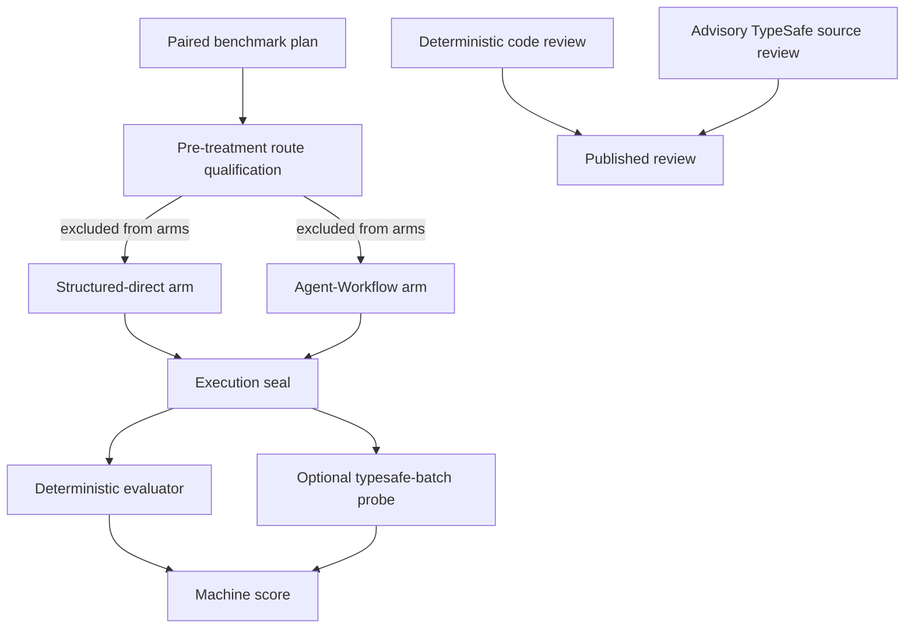

# Agent-Workflow Benchmark


**Agent-Workflow case study:** https://ngallodev-software.uk/projects/agent-workflow  
**Published results:** https://github.com/ngallodev-software/agent-workflow-benchmark-results

`agent-workflow-benchmark` is the optional comparative-benchmark plugin for
Agent-Workflow. It owns benchmark-specific execution, suites, schemas,
scoring/reporting, visual capture, sealed-run evidence, external scoring bundles,
and historical matched-cohort compatibility commands.

The design goal is reproducible comparison rather than headline-only metrics:
treatment identity, execution evidence, post-run scoring, eligibility, and known
limitations are kept explicit enough to inspect independently. Agent-Workflow
core continues to own generic evaluation, review/acceptance, lifecycle, and plugin
authority.

Published finished software and sanitized study evidence live in
[agent-workflow-benchmark-results](https://github.com/ngallodev-software/agent-workflow-benchmark-results).

## Install

Install this package into the same Python environment as Agent-Workflow:

```bash
python -m pip install agent-workflow-benchmark
```

For visual benchmark capture:

```bash
python -m pip install 'agent-workflow-benchmark[visual]'
```

For a source checkout used alongside an Agent-Workflow wheel, use the repository
installer so the plugin is built and installed into the **same shared virtualenv**
that owns the `agent-workflow` launcher:

```bash
bash scripts/build-install.sh
```

The script discovers that virtualenv from the resolved `agent-workflow` launcher,
or accepts an explicit path:

```bash
bash scripts/build-install.sh --venv /path/to/shared-agent-workflow-venv
```

It performs a clean wheel build, uninstalls the previous benchmark distribution,
removes only benchmark-owned stale package artifacts, installs the new wheel with
`--no-deps` so Agent-Workflow itself is not replaced, then verifies:

- Agent-Workflow and the benchmark distribution resolve from the same virtualenv;
- the installed benchmark version matches this checkout;
- the source, wheel, installed package, and plugin descriptor expose the same schema set and digests;
- exactly one `agent_workflow.plugins` benchmark entry point exists;
- the benchmark distribution owns no standalone console script;
- no stale `benchmark-*.schema.json` files remain in Agent-Workflow's XDG host-data schema directory;
- no stale benchmark schemas remain under the shared virtualenv's Agent-Workflow data files;
- no obsolete `agent-workflow-benchmark` launcher shadows plugin discovery;
- the active `agent-workflow` command resolves to the selected shared virtualenv.

To audit an existing installation without rebuilding it:

```bash
bash scripts/build-install.sh --verify-only
```

Enable the plugin in Agent-Workflow configuration:

```toml
[plugins]
enabled = ["agent-workflow-benchmark"]
```

The `benchmark` command is contributed through the normal `agent_workflow.plugins` entry-point API; Agent-Workflow does not hardcode it. Confirm discovery with:

```bash
agent-workflow --help
agent-workflow benchmark --help
agent-workflow plugins list
agent-workflow commands --format markdown
```

`agent-workflow --no-plugins --help` intentionally shows only the core recovery surface.

## Core compatibility

Plugin version `0.3.9` declares `agent-workflow>=0.11.9,<0.12`; Agent-Workflow `0.11.9` is the minimum supported core for the execution-seal and BM6 blind-run workflow. Agent-Workflow's compatibility lane pins this repository by commit so the plugin/core pair is reproducible rather than resolving a moving default branch.

## Main workflow

A typical development run is:

```bash
agent-workflow benchmark suite-export /tmp/priority-picker-v2 --benchmark-id priority-picker-v2
agent-workflow benchmark validate /tmp/priority-picker-v2/benchmark-spec.json
agent-workflow benchmark auth-check /tmp/priority-picker-v2/executors/codex-subscription.json
agent-workflow benchmark readiness /tmp/priority-picker-v2/benchmark-spec.json \
  --executor /tmp/priority-picker-v2/executors/codex-subscription.json \
  --policy /tmp/priority-picker-v2/policies/development.json
agent-workflow benchmark plan /tmp/priority-picker-v2/benchmark-spec.json \
  --repo /path/to/target --base-ref HEAD \
  --executor /tmp/priority-picker-v2/executors/codex-subscription.json \
  --policy /tmp/priority-picker-v2/policies/development.json
agent-workflow benchmark run RUN_PLAN.json --execution-only
agent-workflow benchmark seal RUN_PLAN.json
agent-workflow benchmark seal-verify RUN_PLAN.json
```

Execution-only runs must be sealed before new machine scoring begins. The seal freezes the run plan, final arm worktree trees, and execution-stage evidence while allowing later visual/scoring artifacts to be added. Other lifecycle commands include `resume`, `status`, `live-start`, `live-stop`, `visual-capture`, `score`, `review`, `consolidate`, `report`, `verify`, and `cleanup`. Use `agent-workflow benchmark --help` for the live command tree.

## Compact benchmark paths

Benchmark 0.3.7 shortens generated runtime paths without changing semantic run IDs or evidence identities. Coordinator artifacts use `c/.awb`, paired worktrees use `pNNN/aNN/{c|w}`, and per-arm stage data lives directly under `.awb`. Generated benchmark filesystem paths are capped below 240 characters; semantic IDs remain in JSON evidence.

## BM6 blind execute-and-seal study

BM6 uses a new **Change Window Planner** task family. The execution suite intentionally contains no reference implementation, no `evaluation/` directory, and no local hidden evaluator. The public scoring contract freezes the dimensions and evidence identities, while the evaluator executable is referenced as `external://score.py` and can be supplied only after execution is sealed.

Run the blind study with:

```bash
bash scripts/run-bm6-blind.sh \
  --root /path/to/artifacts/bm6-run \
  --repetitions 1
```

The runner performs only:

```text
export task -> create fixture -> readiness -> plan -> paired execution -> execution seal -> seal verification
```

It deliberately does **not** run visual capture, machine scoring, consolidation, or reporting. The execution seal hashes the immutable run plan, each final arm worktree tree, and execution-stage evidence before any scorer is introduced.

Later, after a scoring bundle is prepared separately:

```bash
agent-workflow benchmark score RUN_PLAN.json \
  --scoring-bundle /path/to/scoring-bundle
```

The scorer bundle must contain the externally referenced evaluator, and its tree digest plus the evaluator SHA-256 are recorded with scoring evidence. Any post-seal mutation of an arm worktree or execution evidence invalidates the seal and blocks new scoring.

## Universal post-seal scoring bundles

Benchmark 0.3.9 adds a task-agnostic external scorer driven by `bundle.json`.
Create a reusable bundle shell with:

```bash
agent-workflow benchmark scoring-bundle-init /path/to/scoring-bundle
agent-workflow benchmark scoring-bundle-validate /path/to/scoring-bundle
```

A bundle may define arbitrary JSON `parameters`, reusable `probes`, and
dimension-to-contract mappings. Supported probes are:

- **command** — hidden tests, browser checks, custom scripts, linters, or any
  deterministic evaluator. Results can be exit-code, JSON stdout, or a JSON
  result file.
- **typesafe-batch** — a single TypeSafe `system_one` request containing many
  anchored `Score` questions. One high-impact batch can feed several scoring
  dimensions from the same cached result; additional independent batches are
  represented by additional probe entries.
- **llm-command** — a JSON-configured prompt plus bounded worktree/bundle/probe
  context passed to a configured command adapter. JSON stdout and Codex JSONL
  final-message parsing are supported.

TypeSafe/LLM context selection is declarative: worktree globs, exclusions,
bundle context files, prior deterministic probe outputs, byte/file bounds, and
static JSON can all be supplied in the manifest. Probe dependencies are cached
against both the scoring-bundle digest and sealed-worktree digest.

Dimension components consume probe values through JSON Pointer and convert them
to normalized credit with `boolean`, `fraction`, `linear`, `threshold`,
or `mapping` scoring. Multiple internal components may roll up to one or more
frozen scoring-contract checks without changing the pre-run contract.

Sensitive scorer environment variables are not inherited wholesale. A bundle
must list additional names such as `TYPESAFE_API_KEY` under
`runtime.environment_allowlist`. After scoring probes finish, the benchmark
re-verifies the execution seal before writing the machine-score summary; any
task-worktree or execution-evidence mutation aborts scoring.

## Advisory TypeSafe source review

The opt-in `code-review` command appends TypeSafe evidence to a required deterministic review of matched `.py`, `.js`, `.css`, and `.html` files. The Markdown output includes the deterministic review first and verbatim; TypeSafe scores remain a clearly marked supplement. It does not replace or revise deterministic findings, machine scores, eligibility, or human acceptance.

It runs only when Agent-Workflow has `decision_policy.mode = "typesafe"` or `"comparative"` enabled and its TypeSafe runtime is ready. The command uses Agent-Workflow's configured TypeSafe model and key unless `--model` overrides the model. If the feature is disabled or unavailable, it stops with a clear error; no API call is made.

SDK request logging uses `[semantic.typesafe].sdk_log_level` and `[semantic.typesafe].sdk_log` from Agent-Workflow's config. For full HTTP request and response bodies, set the level to `"DEBUG"` and configure a log path; the benchmark appends SDK logs there with owner-only file permissions. These bodies include the submitted source and returned content. Keep this log private. The default level is `"WARNING"`, and SDK logs do not go to the application root logger. This is separate from `api_call_log`, which records Agent-Workflow's structured semantic audit entries.

Install the optional SDK extra when needed:

```bash
python -m pip install 'agent-workflow-benchmark[semantic-review]'
```

Example for BM4 source trees:

```bash
agent-workflow benchmark code-review \
  /path/to/structured-direct/final-project \
  /path/to/agent-workflow-optimized/final-project \
  --requirements /path/to/bm4/task/canonical-task.md \
  --base-review /path/to/bm4/analysis/code-quality-review-gpt6-luna.md \
  --question-set v2 --context-scope matched-file --candidate-order balanced \
  --output /path/to/bm4/analysis/code-quality-review.md
```

The JSON sidecar contains source and deterministic-review hashes, score distributions, confidence, model, request scope, and usage totals; it does not copy source text. Inputs are bounded and paired by relative path. `--question-set v2` uses explicit role-aware score anchors; `--context-scope matched-file` sends one matching file pair per request, while `full-tree` sends the complete matched source set. `--candidate-order reversed` is an evaluation option for checking position sensitivity. Run this only for source you are allowed to send to the configured TypeSafe service. The resulting percentages are advisory semantic judgments, not proof that code works.

## Jev/TypeSafe in the benchmark system

The benchmark uses the TypeSafe SDK in three distinct places, each with a different authority boundary:

1. **Routing qualification:** the runner exercises the real Agent-Workflow `Choice`/`Noul`/`Score` route on the three phase contexts before paired execution. Qualification is reported separately and is excluded from both treatments.
2. **Advisory source review:** `code-review` combines an existing deterministic review with supplementary TypeSafe judgments over matched source files. The deterministic findings remain intact and authoritative; this output does not change scores, eligibility, acceptance, or human review.
3. **Post-seal evaluation probes:** a `typesafe-batch` scoring bundle sends anchored `Score` questions against frozen worktree context. Its output can feed configured evaluator dimensions, but it runs after execution sealing and cannot alter the sealed code or run evidence.



All semantic calls use bounded, declared questions and a configured model/key. The TypeSafe SDK's `system_one` method carries the request; [Jev/System One](https://typesafe.ai/blog/introducing-system-one-models-and-jev) provides the semantic model and typed question primitives. The benchmark owns treatment assignment, execution sealing, score contracts, and publication eligibility. See the official [System One](https://docs.typesafe.ai/concepts/system-one.md), [state](https://docs.typesafe.ai/concepts/state.md), [Choice](https://docs.typesafe.ai/primitives/choice.md), [Noul](https://docs.typesafe.ai/primitives/noul.md), [Score](https://docs.typesafe.ai/primitives/score.md), and [Python SDK](https://docs.typesafe.ai/sdk/python.md) documentation.

## Agent-Workflow value smoke study

Version 0.2 adds benchmark-spec/v3 treatment identity and a runner boundary that can compare a direct coding-agent execution with the real Agent-Workflow Agent Run lifecycle. Historical v1/v2 suites keep their original semantics: their `workflow_full` arm is the structured direct-execution profile, not an Agent-Workflow runtime invocation.

Create the first value smoke suite from the existing priority-picker-v2 fixture/evaluator:

```bash
agent-workflow benchmark value-smoke-export /tmp/aw-value-smoke
agent-workflow benchmark validate /tmp/aw-value-smoke/benchmark-spec.json
agent-workflow benchmark plan /tmp/aw-value-smoke/benchmark-spec.json \
  --repo /path/to/target \
  --base-ref HEAD \
  --executor /tmp/aw-value-smoke/executors/codex-subscription.json \
  --policy /tmp/aw-value-smoke/policies/development.json
agent-workflow benchmark run RUN_PLAN.json --execution-only
```

The smoke study keeps the canonical task, fixture, hidden evaluator, scoring contract, and direct executor identity fixed. Its control treatment is `raw-direct/v1`; its candidate treatment is `agent-workflow-full/v1`, which delegates each benchmark phase through Agent-Workflow using the same configured executor/model identity. Use `--agent-class` on `value-smoke-export` when the local Agent-Workflow runtime uses a different explicit agent class.

The run plan and experiment manifest record the stable internal arm slot separately from `treatment_id` and `runner_kind`. This preserves historical evidence schemas while allowing future structured-direct and ablation studies to reuse the paired harness.

Generic/future Codex benchmark exports now default to `gpt-6-luna`. The historical Round-2 `value-smoke-export` and BM3 `structured-value-smoke-export` helpers explicitly retain `gpt-5.6-luna` and its frozen local price catalog so rerunning those named historical studies does not silently change model cohorts. GPT-6 Luna local price estimates remain unset until a benchmark price catalog is explicitly defined.

Before a v3 plan is created, readiness verifies the Agent-Workflow treatment resolves to a comparable runtime: the mapped Agent-Workflow executor exists, provider family matches, the backend executable is the same direct Codex CLI in both arms, the model is permitted, reasoning-effort semantics are compatible, and the selected Agent-Workflow agent class permits that model. These checks are persisted in the run plan/experiment manifest.

The development installer and value-smoke runner use the same shared Agent-Workflow virtualenv and isolate Agent-Workflow runtime files under that venv:

```text
<venv>/.xdg/config
<venv>/.xdg/state
<venv>/.xdg/data
```

The installer writes a benchmark-owned, minimal venv-local Agent-Workflow config. It sets isolated `worktree_root`/`state_root`, enables only `agent-workflow-benchmark`, selects `semantic.provider = "typesafe"`, and sets `decision_policy.mode = "comparative"`. It does not mutate arbitrary user TOML. The smoke runner applies the XDG environment only to its own process, so the caller shell is automatically unchanged when the run exits.

The benchmark runtime is intentionally comparative: `typesafe-sdk==0.6.0`, `TYPESAFE_API_KEY`, and `agent-workflow-comparative-eval==0.1.0` are required in the shared venv. The comparative-eval package is a shared library, not an `agent_workflow.plugins` entry point.

### TypeSafe request/response audit

The value-smoke runner sets `AGENT_WORKFLOW_TYPESAFE_API_CALL_LOG` to
`<smoke-root>/typesafe-api-audit.jsonl`. Agent-Workflow 0.11.6+ writes
redacted `agent-workflow/typesafe-api-call/v2` records there, including the
logical request, raw HTTP request/response bodies when exposed by TypeSafe SDK
0.6.0, normalized typed answers, model/version identity, hashes, and duration.
The evidence collector includes that JSONL file and records only aggregate
audit metadata in its manifest; the collector still refuses to archive if the
current `TYPESAFE_API_KEY` value appears anywhere in collected files.

For an authenticated end-to-end smoke run, the repository includes:

```bash
bash scripts/run-value-smoke.sh
```

The value smoke is intentionally **Codex-only**. It always uses the packaged `codex-subscription.json` executor profile; alternate provider profiles are not part of this smoke path.

Benchmark `0.3.9` requires Agent-Workflow `>=0.11.9,<0.12`. That core version automatically captures headless Codex JSONL telemetry so the Agent-Workflow arm can provide comparable input/cached/output/reasoning token evidence. After execution, the smoke validates `token_evidence_complete=true` for the selected attempt of both arms; an evidence failure preserves the run but prevents treating it as efficiency-qualified.

Useful environment overrides:

```bash
AGENT_CLASS=implementation bash scripts/run-value-smoke.sh
VALUE_SMOKE_ROOT=/tmp/aw-value-smoke-run bash scripts/run-value-smoke.sh
```

The helper exports the v3 smoke suite, creates the frozen fixture repository, verifies full-pipeline readiness before expensive execution, creates the paired plan, executes the paired treatments, then starts the live app and captures required visual evidence before machine scoring and consolidation. Human review remains a separate completion gate for composite/winner claims.

Git evidence now records committed, uncommitted, and untracked task changes. The canonical patch includes tracked changes relative to the benchmark base revision plus synthetic patches for untracked files, and `git-evidence.json` records both `base_revision` and `head_revision` so Agent-Workflow commits remain visible even when the worktree is clean.

After any completed or failed smoke run, preserve the raw evidence with:

```bash
python scripts/collect-value-smoke-evidence.py /tmp/agent-workflow-value-smoke.XXXXXX
```

If the smoke root is omitted, the collector chooses the newest `$TMPDIR/agent-workflow-value-smoke.*` directory. It packages the complete smoke root, the referenced coordinator run directory, and every arm evidence directory referenced by the run plan so `arm.json`, provider telemetry, Git evidence, and phase receipts remain self-contained. It records package/runtime identity without secret values, writes SHA-256 checksums, and refuses to archive if the current `TYPESAFE_API_KEY` value is found in collected files.

## Supplementary end-to-end product score

Priority Picker v2 runs now emit a second, versioned score from the same frozen
execution and visual evidence:

```text
score.json          official frozen machine score (unchanged)
product-score.json  supplementary end-to-end-product/v1 score
```

The supplementary 100-point lens weights delivered product behavior more heavily:

- 30 points: core computation/data-layer correctness;
- 20 points: end-to-end supplied-data integration;
- 20 points: required interactive behavior;
- 15 points: presentation/accessibility;
- 5 points: robustness/failure handling;
- 10 points: engineering completeness/traceability.

Item-dependent credit is gated on the expected supplied backlog actually rendering
in the browser. Structured visual observations are captured in
`visual/assessment.json` so partial product credit is deterministic rather than
inferred from prose logs.

The supplementary score is deliberately **not** part of the historical machine
score, composite, eligibility, or winner policy. Reports aggregate and compare it
as a parallel diagnostic/product-completeness metric only. The versioned authority
is `product-scoring-contract.json` with scorer ID
`end-to-end-product/v1`.

## BM5 steering-first Agent-Workflow study

Benchmark plugin 0.3.4 added the pre-BM5 treatment exported by:

```bash
agent-workflow benchmark bm5-export /path/to/suite
```

BM5 keeps GPT-6 Luna/high and the structured-direct control from BM4 while
changing the Agent-Workflow candidate through OPT-010 through OPT-015:

- one normal `agent finish` closeout transaction;
- host-run/reused declared acceptance commands;
- host-derived deterministic criterion evidence;
- steering-first worker context with exceptional protocol commands;
- per-command/tool-family/cache-hit amplification telemetry;
- conditional verify/repair model invocation.

For the Priority Picker study the candidate binds deterministic acceptance
commands per phase. When the implementation phase completes with green
acceptance verification, the separate candidate verify/repair model phase is
recorded as a deterministic conditional skip rather than launching another
model turn. If implementation verification cannot complete cleanly, the
verify/repair phase remains available for repair.

The candidate telemetry records normalized command families, Agent-Workflow
protocol command counts, steering/ack message counts, acceptance-command
executions, verification-cache hits/misses, and `agent finish` outcomes.
These fields are descriptive diagnostics and do not change scoring.

Each phase also records prompt/output hashes and the worktree file delta from
the phase start to its end. A paired `phase-reviews/<phase-id>.json` compares
control and candidate states, changed paths, timing, usage, and available cost fields.
These reviews do not gate phase completion or acceptance, and paired
differences do not prove that a workflow phase caused an outcome. Use matched
phase ablations to test causal value.

## BM3 structured-direct study

Benchmark 0.3 adds the diagnostic BM3 comparison:

```text
structured-direct/v1
vs
agent-workflow-full/v1
```

Both arms receive the structured `workflow_full` prompt profile; only the candidate runs through the real Agent-Workflow lifecycle. This isolates lifecycle/orchestration overhead from the structured-prompt treatment itself.

Run the full development study with:

```bash
bash scripts/run-bm3-structured.sh --help

bash scripts/run-bm3-structured.sh \
  --root /path/to/artifacts/bm3-$(date -u +%Y%m%dT%H%M%SZ) \
  --repetitions 1
```

The runner first performs a separate pre-treatment TypeSafe/Jev routing qualification over the three BM3 phase prompts, then runs readiness, planning, paired execution, machine scoring, descriptive reporting, granular timing capture, and self-contained evidence collection. The paired treatments themselves do not invoke semantic routing, preserving runtime comparability.

See [docs/BM3_STRUCTURED.md](docs/BM3_STRUCTURED.md) for the complete self-service workflow, manual command equivalent, evidence layout, troubleshooting, and interpretation rules.

## Legacy command migration

The former Agent-Workflow core commands are preserved under explicit compatibility names:

```text
agent-workflow eval validate-benchmark  -> agent-workflow benchmark legacy-validate
agent-workflow eval benchmark-report    -> agent-workflow benchmark legacy-report
```

Generated benchmark reports now reproduce the plugin-owned command paths. Historical schema IDs remain unchanged because they identify evidence semantics, not Python package ownership.

## CLI reference

The CLI is generated from the plugin parser at runtime. Do not maintain a separate static command list or man page; use:

```bash
agent-workflow benchmark --help
agent-workflow commands --format markdown
agent-workflow completion bash
```

so documentation/completion stays aligned with the installed plugin version.
